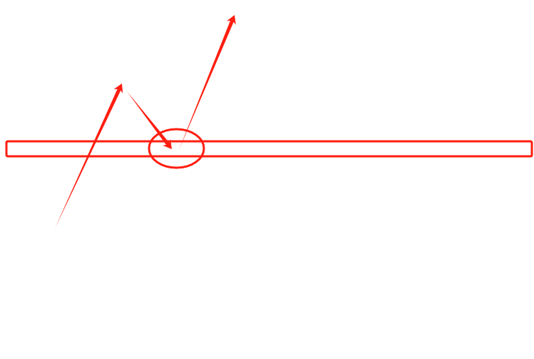

# 🎩 关于策略，怎么看懂云舒在写啥？

首先明确一点，一切描述策略本身的词语不懂的你可以直接来问

1.突破xxx区间后站稳：这句话我们追求的是红圈内的买点形态，一般你的介入可以在红圈处发生回弹时尝试，止损一般直接挂这个方框代表的xxx区间上下沿或上下沿之间。

<figure><figcaption></figcaption></figure>

2.等待XX小时内，在XX价位起量后右侧：灰色区域代表volume柱体，在我给的时间内在XX价位出现灰色区域形态即做多/空，止损一般就0.5%左右。

<figure><figcaption></figcaption></figure>

3.在XX区间和XX区间之间，波段：

一般波段开单，在红色位置，区间上沿开空挂紧止损，区间下沿开空挂区间上沿损

在黄色位置，区间上沿开多挂区间下沿损，区间下沿开多挂紧止损

<figure><figcaption></figcaption></figure>

