# 🌴 （形态基础）快速了解K线技术形态

### 1.K线的来历与定 义

K线是由日本的一位白米商人本间宗久在1705年发明的标有开盘、最高、最低、收盘四种价位的K线表示。

<figure>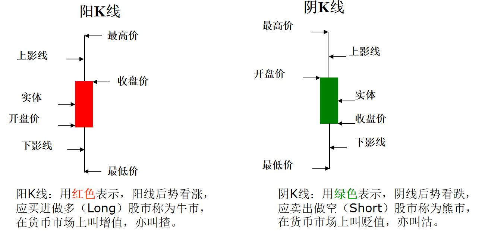<figcaption>
1.1
</figcaption></figure>

### 2. 单根K线的分类

#### 2..1 光头光脚的小阳线

表示最低价与开盘价相同，最高价与收盘价相同。上下价位窄幅波动，表示买方力量逐步增加，买卖双方多头力量暂时略占优势。此形态常出现在上涨初期、回调结束或盘整的时候。

<figure><figcaption></figcaption></figure>

#### 2.2 光头光脚的小阴线

表示开盘价就是最高价，收盘价就是最低价，价格波动幅度有限，表示卖方力量有所增加，买卖双方空方力量暂时略占优势。此形态常出现在下跌初期、横盘整理或反弹结束的时候。

<figure><figcaption></figcaption></figure>

#### 2.3 大（全）阳线

没有上下影线，表示多方走势强劲买方占绝对优势，空方毫无抵抗，经常出现在脱离市场底部的初期，回调结束后的再次上涨，高位的拉升阶段，有时也在严重超跌后的大力度反弹中出现

<figure><figcaption></figcaption></figure>

#### 2.4 大（全）阴线

没有上下影线，表示空方走势强劲卖方占绝对优势，多方毫无抵抗，经常出现在头部开始下跌的初期，反弹结束后的打压过程中。

<figure><figcaption></figcaption></figure>

#### 2.5 上影阳线

这是上升抵抗型，表示多方在上攻途中遇到了阻力。此形态常出现在上涨的途中，上涨的末期或汇价从底部启动遇到了密集成交区，上影线和实体的比例可以反映多方遇阻的程度，上影线越长，表示压力越大，实体的长度越长，表示多方的力量越强。

<figure><figcaption></figcaption></figure>

#### 2.6 上影阴线

这是上升抵抗型，表示多方在上攻途中遇到了阻力。此形态常出现在上涨途中，上涨末期或汇价遇到密集成交区，上影线和实体的比例反映多方遇阻的程度。上影线越长，表示压力越大。

<figure>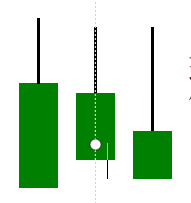<figcaption></figcaption></figure>

#### 2.7 下影阳线

这是先跌后涨型（也称下跌抵抗型），反映汇价在低位获得买方的支撑，卖方受挫。预示后势有上涨的可能（如果实体过长则另当别论）。

<figure><figcaption></figcaption></figure>

#### 2.8 下影阴线

这也是下跌抵抗型或换跌后涨型，表示空方力量强大，但在下跌途中上定程度上受到买方的抵抗，常出现在下跌途中。下影线越长，买方力量越大。

<figure><figcaption></figcaption></figure>

#### 2.9 带上下影线的阳线

表示下有支撑，上有压力。总体买方占优。常出现在市场的底部，上升途中。上影线越长，说明上方压力大；下影线越长，说明下方支撑强；实体越长，说明多方实力强

<figure><figcaption></figcaption></figure>

#### 2.10 带上下影线的阴线

表示下有支撑，上有压力，总体卖方占优。常出现在市场的底部，上升途中。上影线长，说明上方压力大；下影线长，说明下方支撑强；实体越长，说明空方实力强。

<figure><figcaption></figcaption></figure>

#### 2.11 十字星图形

表示开盘价和收盘价相同，多空力量暂时处于平衡。

<figure><figcaption></figcaption></figure>

#### 2.12 T字形

也属于十字星的变形形态，表示开盘价和收盘价相同，下影线表示下方有一定的支撑，预示着后势将向上反转。

<figure><figcaption></figcaption></figure>

#### 2.13 一字形

此种形态表示开盘价、最高价、最低价、收盘价在同一价位，在此时段内，汇价没有任何变化。分钟图中有可能出现，较长周期K线图几乎没有出现的可能。

<figure>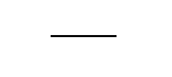<figcaption></figcaption></figure>

#### 2.14 锤头

在长期的下跌趋势中，锤头的出现预示着下跌趋势将结束，是较为可靠的底部形态。可以是阳锤头，也可以是阴锤头。上影线几乎没有，下影线是实体的2倍以上。

<figure>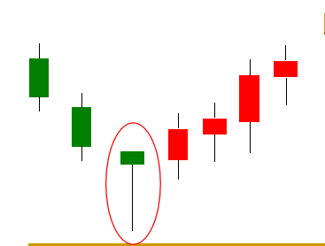<figcaption></figcaption></figure>

#### 2.15 吊颈

吊颈是出现在涨势中具有较长下影线的实体较小的阴线或阳线。见顶信号的一种。

<figure>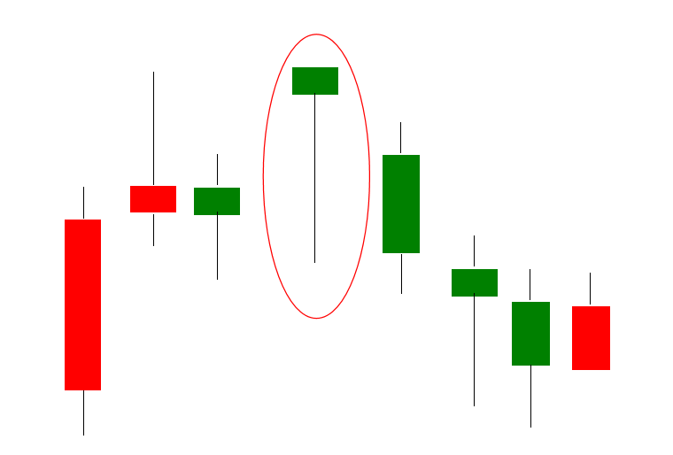<figcaption></figcaption></figure>

#### 2.16 射击之星

此图形在上升过程中出现是较为可靠的转势信号，上影线为实体的2倍以上，下影线没有

<figure>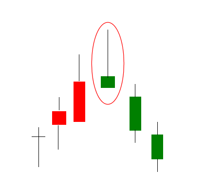<figcaption></figcaption></figure>

#### 2.17 倒转锤头

倒转锤头，见底信号

<figure>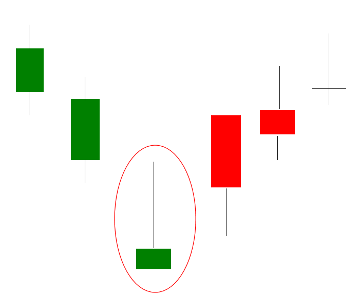<figcaption></figcaption></figure>

#### 2.18 垂死十字星（墓碑）

有较长上影线，开盘价，收盘价处于相同的水平，是可靠的转势信号。

<figure><figcaption></figcaption></figure>

### 3. K线组合形态

#### 3.1 早晨之星

早晨之星，也称黎明之星。由三根K线组成，是可靠程度甚强的转势信号。 （1）在下跌过程中出现实体修长的阴线。 （2）k线的实体部分逐渐缩小，形成星的主体。 （3）出现大阳线，价格回升至第一根k线范围内。

<figure>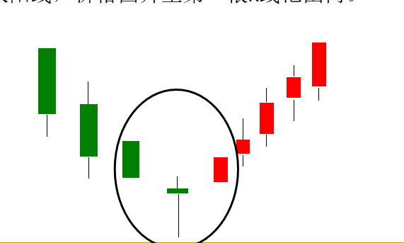<figcaption></figcaption></figure>

#### 3.2 黄昏之星

“夕阳无限好，只是近黄昏” 顾名思义，光明即将过去，黑暗即将来临，在上升过程中出现此图形是较为可靠的转势信号 （1）在上升过程中，出现实体修长的阳线。 （2）跳空高开，k线的实体逐渐缩小，形成星的主体部分。 （3）出现大阴线。

<figure>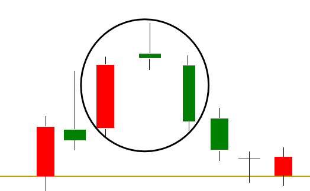<figcaption></figcaption></figure>

#### 3.3 吞没形态

吞没形态是由两根大小不等、阴阳相反的K线组成。吞没形态是经常出现且较为有效的反转形态。分为两种情况：

第一种是出现在上升行情中，前一根为阳线，后一根为阴线，后者将前者实体完包容在内（可不包括上下影线）。

<figure>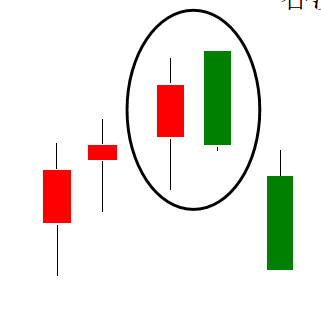<figcaption></figcaption></figure>

第二种是出现在下跌行情中，前一根为阴线，后一根为阳线，后者将前者实体完全包容在内（可不包括上下影线）。

<figure>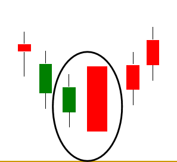<figcaption></figcaption></figure>

#### 3.4 乌云盖顶

1、在上升过程中，出现实体修长的阳线。

2、跳空高开，低走，以最低点收盘，形成大阴线。

3、第2根k线收盘价在第1根k线实体1/2以下。

<figure>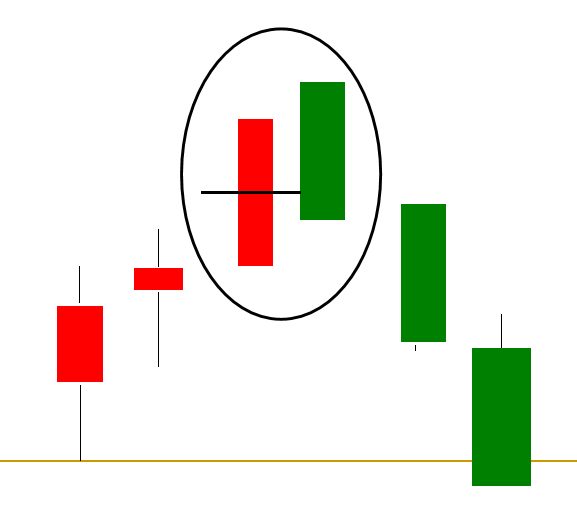<figcaption></figcaption></figure>

#### 3.5 曙光初现

1、在下跌过程中，出现实体修长的阴线。

2、跳空低开，高走，以最高点收盘，形成大阳线。

3、第2根k线收盘价在第1根k线实体1/2以上。

<figure>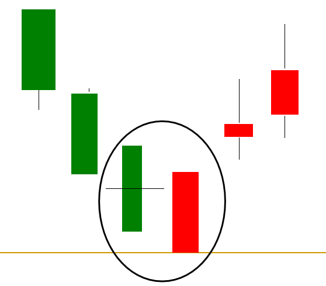<figcaption></figcaption></figure>

#### 3.6 好友反攻

1、在下跌过程中，出现实体修长的阴线。

2、跳空低开，高走，以最高点收盘，形成大阳线。

3、第2根k线收盘价与第1根k线收盘价处于相同水平。

<figure>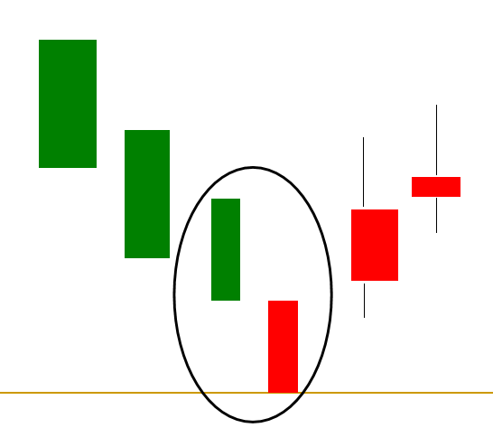<figcaption></figcaption></figure>

#### 3.7 淡友反攻

1、在上升过程中，出现实体修长的阳线。

2、跳空高开，低走以最低点收盘，形成大阴线。

3、第2根k线收盘价与第1根k线收盘价处于相同水平。

<figure>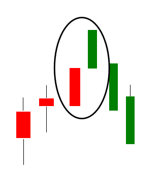<figcaption></figcaption></figure>

#### 3.8 平顶

平顶是由两根或两根以上的K线组成，出现在上涨趋势中，且最高价处于同一价位。是见顶信号的一种。平顶形态在日常操作中并不常见，但一旦出现，准确性较高。

<figure>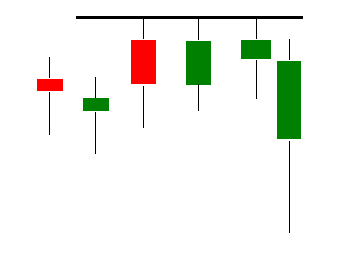<figcaption></figcaption></figure>

#### 3.9 平底

平底是由两根或两根以上的K线组成，出现在下跌趋势中，且最低价处于同一价位。是见底信号的一种。平底形态在日常操作中并不常见，但一旦出现，准确性较高。

<figure>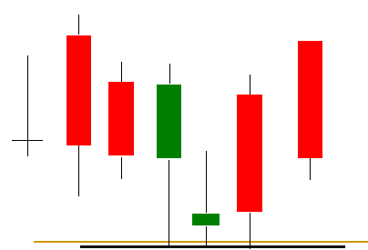<figcaption></figcaption></figure>

#### 3.10 双飞乌鸦

1、由2根阴线组成。

2、第一根k线跳空高开，低走，形成阴线，欲飞无力.

3、第二根k线再次跳空高开低走，形成阴线。

4、第一根阴线与上一根k线有缺口。

<figure>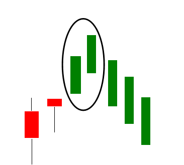<figcaption></figcaption></figure>

#### 3.11 三飞乌鸦

1、连续3根阴线组成。

2、收盘价是当根k线最低点。

3、每根k线开盘价在上根k线实体内。 4、每根k线收盘价都在下跌。 5、第1根阴线开盘价不能高于上根k线。

<figure>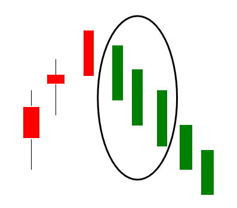<figcaption></figcaption></figure>

#### 3.12 上升三法

1、在上升过程中出现1根大阳线。

2、出现3个实体短小的阴线，轻微下跌，但在第一个阳线范围内活动。

3、出现大阳线，收盘价超越第一个阳线最高点。

<figure>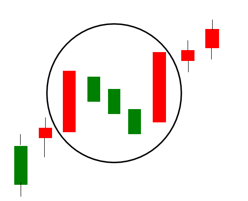<figcaption></figcaption></figure>

#### 3.13 身怀六甲（孕线）

身怀六甲由两根K线组成，表示行情将要转向，分为两种情况：\
第一种是在上升行情中，前一根为阳线，后一根为阴线，前者将后者实体完全包容在内（可不包括上下影线）。

<figure>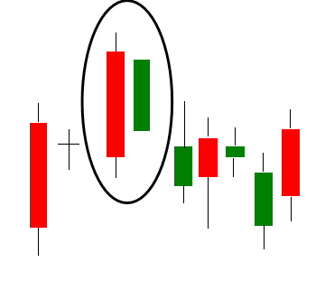<figcaption></figcaption></figure>

第二种是在下跌行情中，前一根为阴线，后一根为阳线，前者将后者实体完全包容在内（可不包括上下影线）。

<figure>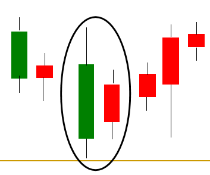<figcaption></figcaption></figure>

### 4. 走势技术形态分析

趋势可以分三种：上升，下降，无趋势状态（横盘整理）

<figure>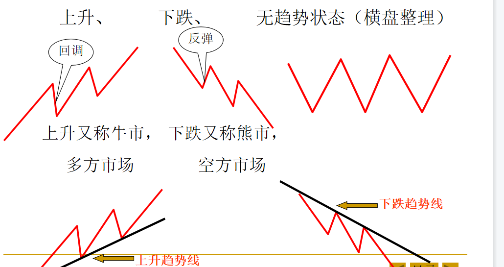<figcaption></figcaption></figure>

#### 4.1头肩顶

两肩形成的时间要对称。目标价位为头部到颈线BD的垂直距离 下跌目标从F点算起≥CN

<figure>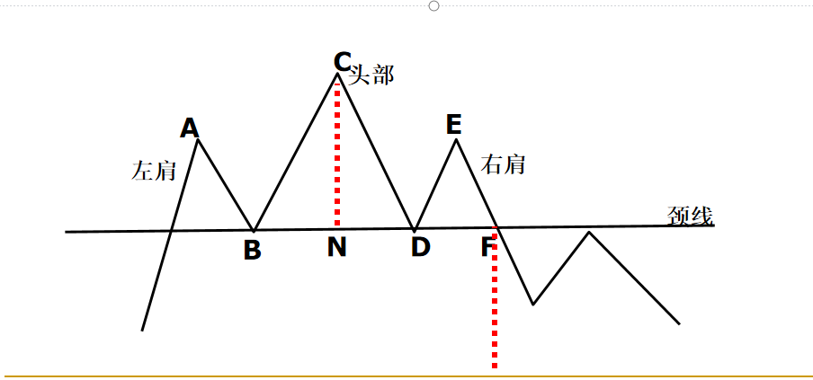<figcaption></figcaption></figure>

#### 4.2 头肩底

两肩运行的时间要大致相等，当价格向上突破颈线以后， 上升距离≥CN的距离。

<figure>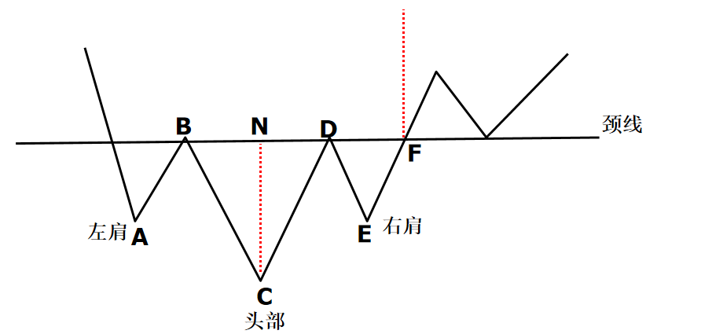<figcaption></figcaption></figure>

#### 4.3 复合头肩顶/底

<figure>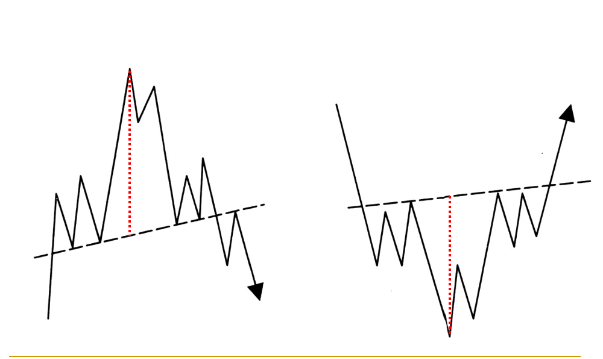<figcaption></figcaption></figure>

#### 4.4 双顶M顶

1、A、C两点相平

2、通过B点做与AC平行的平行线叫颈线

3、行情破颈线后跌势形成，下跌目标FB距离

4、2个顶时间间隔越长，效果越好。

<figure>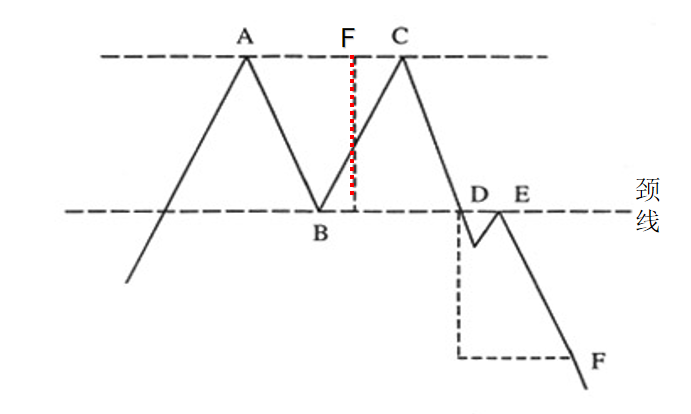<figcaption></figcaption></figure>

#### 4.5 双底W底

1、A、C两点相平

2、通过B点做与AC平行的平行线叫颈线

3、行情破颈线后涨势形成，上涨目标FB距离

4、2个顶时间间隔越长，效果越好。

<figure>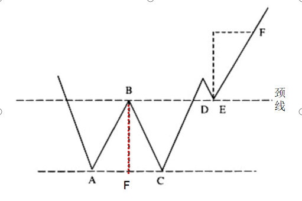<figcaption></figcaption></figure>

#### 4.6 V形底，V形顶

V形底走势，可分为三个部分： （1）、下跌阶段 （2）、转势点 （3）、回升阶段

V形顶走势，可分为三个部分： （1）、上升阶段 （2）、转势点 （3）、下跌阶段

<figure>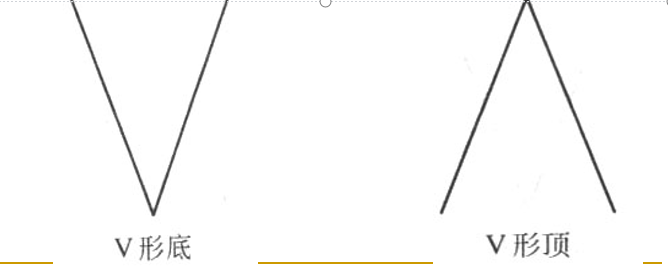<figcaption></figcaption></figure>

#### 4.7 圆弧底/顶

<figure><figcaption></figcaption></figure>

#### 4.8 上升三角形和下降三角形

<figure><figcaption></figcaption></figure>

#### 4.9 旗形整理

<figure><figcaption></figcaption></figure>

#### 4.10 箱形

<figure><figcaption></figcaption></figure>

#### 4.11 阻力和支撑互换

<figure>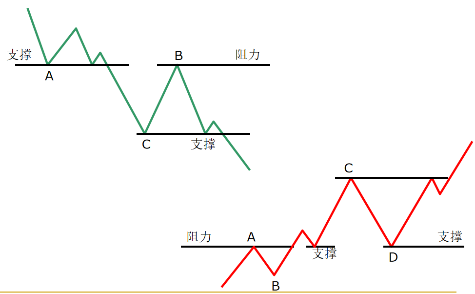<figcaption></figcaption></figure>
