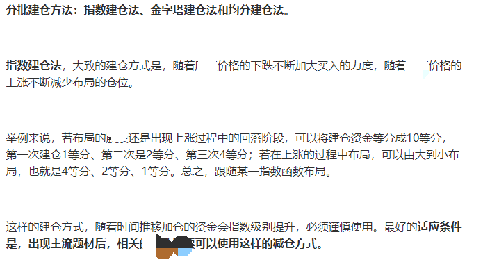
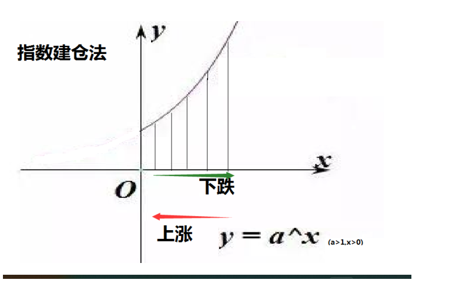
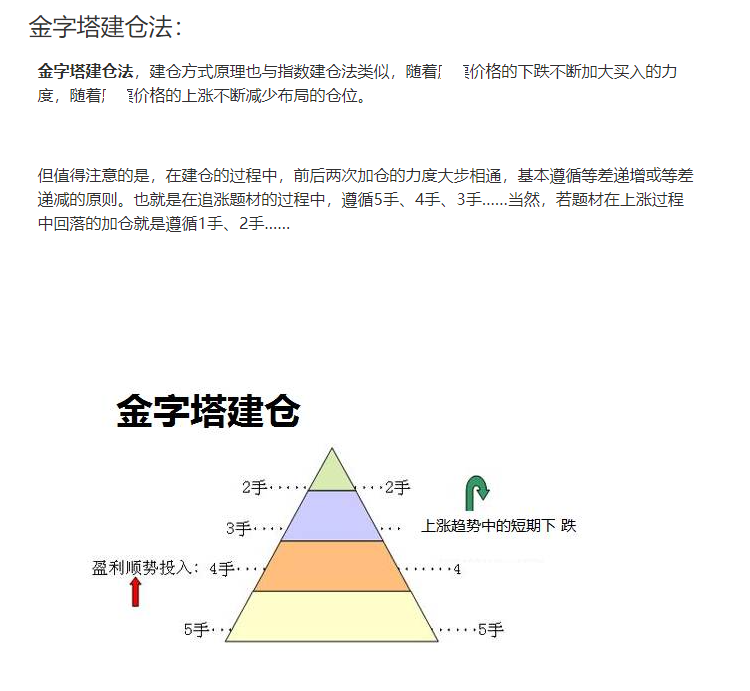
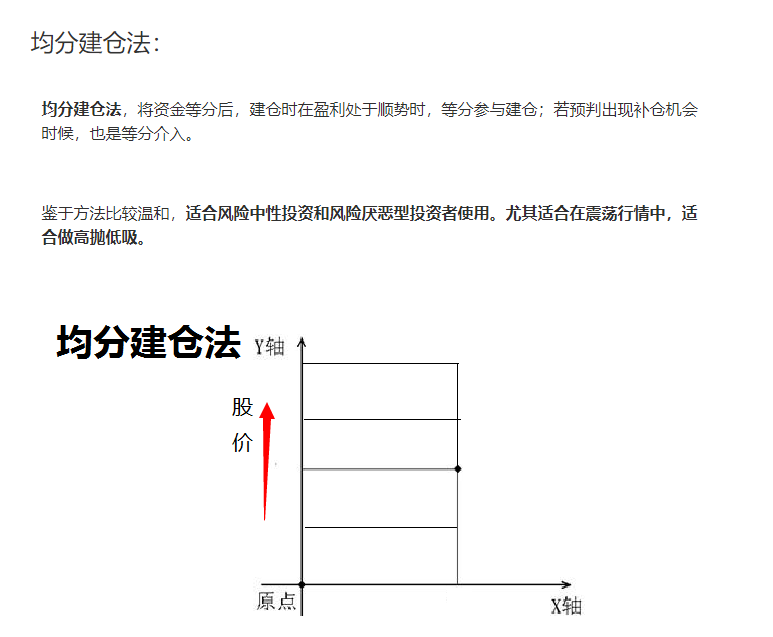

# 🥬 如何分批建仓

如果你分批建仓，很可能在更低的位置吸筹，摊薄成本的同时，还能捕获很好的“猎物”。同样，分批减持也是这个道理，能在防控风险的同时，保证较丰厚的收益。总体来看分批建仓或减持有以下好处：

**1.规避“诱空”、“诱多”带来的预判失误；**

**2.防控风险的同时，降低建仓成本；**\

**3.防控风险的同时，保证投资收益。**

当然，分批也是有适应范围的。分批建仓或减持都是建立在行情走势平稳的状态下，暴涨、暴跌、闪崩等突发情况除外。

<figure><figcaption></figcaption></figure>

<figure><figcaption></figcaption></figure>

<figure><figcaption></figcaption></figure>

<figure><figcaption></figcaption></figure>

#### 来说说为什么都要求分批进场，因为有一个说起来很简单的道理：道理很简单，但是90%的人都不明白，话糙理不糙，如果单子是错的，你早进跟晚进一样的没有区别，只是你多亏几毛钱的区别，如果单子是对的，哪怕你提前进，或者踩着尾巴进去，你都可以吃到肉或者喝到汤！他也一样是对的！但是人们会这么想吗？涨了不敢空，去追多；跌了不敢多去，踏空。我们参考以太历史最高点4868美元，最低81美元！大多数人选择了沉默！确实没有所谓的对比，没有对比就没有所谓的高点与低点！没有对比就没有伤害！
