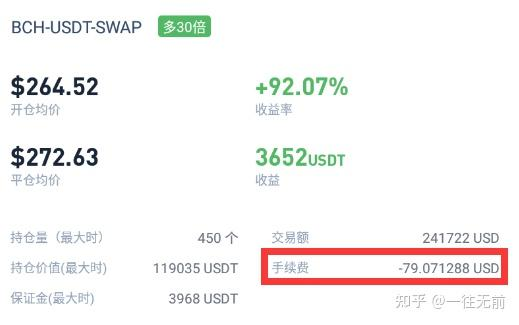
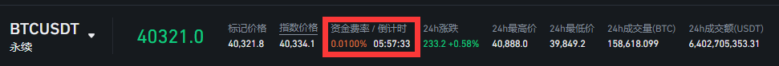

# 🌴 （入门-交易篇）新手如何玩合约

有很多人刚进入币圈就想了解一下合约，下面咱们就来讲一下合约当中有哪些值得注意的

* 永续合约与交割合约
* 多头与空头
* 杠杆倍数
* U本位与币本位的区别
* 手续费计算
* 资金费是什么
* 全仓、逐仓是什么意思
* 爆仓
* 单向持仓与双向持仓
* 头寸

### 永续合约与交割合约

永续合约类似于传统的合约，主要区别在于：永续合约没有到期日或结算日

交割合约则会有一个期限，到期会自动进行平仓结算

### 多头与空头

#### “多头”和“空头”是两种投资策略

“多头”是指预期资产价格会上涨，因此购买持有该资产，期待未来能以更高的价格卖出，从而获得收益。这种是最常见的投资策略。通常在币圈中，开涨也叫做多

“空头”则是与“多头”相反的策略，预期资产价格会下跌。空头策略通常是通过借入资产并立即卖出，然后等待价格下跌后再以更低的价格买入，归还所借资产，并将差价作为收益。这种策略在股票、期货等金融市场中都有应用。在币圈中，也叫做空

做空通常出现在合约里面

### 杠杆倍数

杠杆是一个很重要的概念，简单来说，就是用较小的资金去撬动较大的投资额度，从而获取更高的收益

举个栗子：小明有1000本金，但是他觉得这个本金收益太慢了，便用了10倍杠杆，此时他的本金可以放大到10000进行操作，如果价格上涨了，他的收益就会比没有使用杠杆的情况下更高。

高收益伴随着高风险，杠杆也是一把双刃剑，如果投资失败，损失的金额也会比没有使用杠杆的情况下更大。因此，使用杠杆需要谨慎，需要充分了解风险。

### U本位与币本位的区别

币本位是以币为单位开仓，结算单位都为币，比如BTC、ETH、LTC等

U本位是以U为单位开仓，结算单位都为U

币本位需要先用U购买现货了划转到合约账户才能开币本位仓位

两者主要的区别就是结算单位不同，还有交易对和交易量不同

如果是长期看涨，币本位比U本位的实际盈利要多

比如比特币价值3000u，涨到6000u了，同等本金、杠杆下两个做多的盈利是不相同的

本金都为3000u，杠杆倍数为10倍

U本位仓位价值为3000u，币价涨到6000，实际盈利为30000u

币本位仓位价值为1个比特币（3000u），币价涨到6000，实际盈利为5个比特币＋本金上涨的价值

5×6000+3000

**不管哪种模式，风险都是同样的**

### 手续费计算

很多人都不知道手续费怎么计算，甚至会忽略手续费的支出

<figure><figcaption></figcaption></figure>

这时小明又出现了...

小明购买一个价值50000的大饼，本金为500，使用100倍的杠杆，持仓价值就是50000

持仓价值=本金×杠杆倍数

按照头部平台币安的市价费率来算，交易一个大饼（买和卖）需要40的手续费，差不多占本金的10%了

这还只是一次的交易，如果频繁交易下来，手续费支出是非常恐怖的，这也是交易所平台的一大收入来源

**手续费计算方式：**

持仓价值×手续费率=手续费

### 资金费

&#x20; 资金费率是指基于永续合约市场价格与现货价格之间的价差，向多头或空头交易者支付的定期费用。

&#x20; 当市场趋势看涨时，资金费率为正，而且会随着时间上涨。

&#x20; 在这个情况下，永续合约的多头交易者将会支付资金费用给对方的交易者。

&#x20; 相反，当市场看跌时，资金费率为负，此时是永续交易的空头交易者向多头交易者支付资金费用。

资金费用是场内多空双方互相给的

#### 为什么资金费率如此重要？

&#x20; 资金费率的主要作用就是用来缩小永续合约市场与对应现货市场的价差（价格回归）

&#x20;  永续合约和传统合约的不同之处在于它没有到期日。因此，交易者可以永久持仓，除非他遭到强平。因此，永续合约的交易和现货交易非常相似。

&#x20;   因此，加密货币交易所创建了一个机制，确保永续合约的价格会和指数相应。这就是所谓的资金费率。

资金费率每8小时结算一次，分别为0点、8点、16点

&#x20;   只有在结算时间点持有仓位，才会进行结算

&#x20;   **资金费用实际收取时间存在 15 秒偏差**。例如，当交易者在 08:00:05 UTC 开仓，依然可能被获得或支付资金费率，请留意您的开仓时间。

<figure><figcaption></figcaption></figure>

资金费率通常初始默认为0.01%，由于场内多空比例不同会进行波动变化

资金费计算方式：

持仓价值×资金费率=资金费

资金费率为正，多头支付给空头

资金费率为负，空头支付给多头

资金费率只是一个参考指标，并不能当做开仓的全部依据噢\~

### 全仓、逐仓是什么意思

**全仓和逐仓是两种不同的交易模式**

**全仓模式下**，小明账户内有10000，用了5000去开比特币多单，用了3000去开以太坊多单，账户内还剩余2000.这时突然来了一条新闻

**美联储宣布加息\*\*%**

市场行情瞬间暴跌，boom，小明sisi盯着屏幕，念叨着全没了，全没了...

第二天小明又来了，想着昨天都跌成那样了，可以抄底了！！！

这次他使用逐仓模式，又冲入10000，用5000开比特币多单，但是行情不如小明所想，继续下跌，又爆了

但是，账户内剩余的5000保证金没有受到影响

以上只是举例说明全仓模式下的一些潜在风险

**总结一下：**

全仓模式下，保证金都是共享的，比如开了四五个仓位，只要其中一个仓位扛不住爆了，其他也会被强平

逐仓模式下，每个仓位保证金都是单独成立的，互相不受影响，但是需要手动单独添加保证金

各有优势\~

### 爆仓

爆仓一词，在合约中特别常见，但是谁也不想碰到的一种情况，这一点就是合约与现货最大的一个区别

爆仓也可以叫它强制平仓，爆仓通常指的是账户因为无法满足保证金的最低要求而被强制平仓，也就是被迫把持有的仓位全部平掉。这通常发生在投资者使用杠杆投资并且市场走势与预期相反的情况下。

如果用10倍杠杆放大1000的本金去开仓，你所能承受的波动为10%

如果用100倍杠杆放大1000的本金去开仓，所能承受波动仅为1%

就像在杠杆那里说的，是一把“双刃剑”

往往爆仓就是因为使用高杠杆导致的，**交易切勿急躁**\~

### 单向持仓与双向持仓

单向持仓：仓位只能开一个方向，如果开对向仓位，会自动平掉当前仓位，交易前请确认好交易模式

双向持仓：可以同时开双向的仓位，通常用来锁仓

### 头寸

很多人多这个词有点陌生，简单一点来理解就是

在不同杠杆倍数之下，你所能开的仓位价值是不同的（仅针对币圈合约而言，如有错误，感谢指正）

